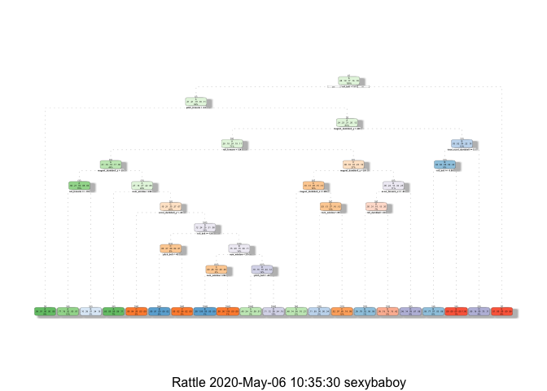

Practical Machine Learning Course Project : Prediction Assignment
================
Cecilia Cruz-Ram, MD DPCOM
04/27/2020

## Instructions:

Using devices such as Jawbone Up, Nike FuelBand, and Fitbit it is now
possible to collect a large amount of data about personal activity
relatively inexpensively. These type of devices are part of the
quantified self movement – a group of enthusiasts who take measurements
about themselves regularly to improve their health, to find patterns in
their behavior, or because they are tech geeks. One thing that people
regularly do is quantify how much of a particular activity they do, but
they rarely quantify how well they do it. In this project, your goal
will be to use data from accelerometers on the belt, forearm, arm, and
dumbell of 6 participants. They were asked to perform barbell lifts
correctly and incorrectly in 5 different ways.

More information is available from the website here:
<http://web.archive.org/web/20161224072740/http:/groupware.les.inf.puc-rio.br/har>
(see the section on the Weight Lifting Exercise Dataset).

In this project, the goal is to use data from accelerometers on the
belt, forearm, arm, and dumbell of 6 participants. They were asked to
perform barbell lifts correctly and incorrectly in 5 different ways.

The goal is to predict the manner in which the exercise was done.

## Simulations:

A. Free Up Memory

``` r
rm(list=ls())
```

B.
Setwd

``` r
setwd("~/Documents/Files/Zetch/Online Courses/Data Science Specialization Feb18/R/Practical Machine Learning")
```

C. Load Data

``` r
library(caret)
```

    ## Loading required package: lattice

    ## Loading required package: ggplot2

``` r
library(knitr)
library(rpart)
library(rpart.plot)
library(rattle)
```

    ## Rattle: A free graphical interface for data science with R.
    ## Version 5.2.0 Copyright (c) 2006-2018 Togaware Pty Ltd.
    ## Type 'rattle()' to shake, rattle, and roll your data.

``` r
library(randomForest)
```

    ## randomForest 4.6-14

    ## Type rfNews() to see new features/changes/bug fixes.

    ## 
    ## Attaching package: 'randomForest'

    ## The following object is masked from 'package:rattle':
    ## 
    ##     importance

    ## The following object is masked from 'package:ggplot2':
    ## 
    ##     margin

``` r
library(corrplot)
```

    ## corrplot 0.84 loaded

``` r
set.seed(12345)
```

``` r
# Set the URL for the download
UrlTrain <- "http://d396qusza40orc.cloudfront.net/predmachlearn/pml-training.csv"
UrlTest  <- "http://d396qusza40orc.cloudfront.net/predmachlearn/pml-testing.csv"

# Download Datasets
training <- read.csv(url(UrlTrain))
testing  <- read.csv(url(UrlTest))

# Create a partition with the training dataset 
inTrain  <- createDataPartition(training$classe, p=0.7, list=FALSE)
TrainSet <- training[inTrain, ]
TestSet  <- training[-inTrain, ]
dim(TrainSet)
```

    ## [1] 13737   160

``` r
dim(TestSet)
```

    ## [1] 5885  160

Data sets consists of 5885 values with 160 variables.

D. Clean and Pre-process Data

Remove values with Near Zero Variance (NZV).

``` r
NZV <- nearZeroVar(TrainSet)
TrainSet <- TrainSet[, -NZV]
TestSet  <- TestSet[, -NZV]
dim(TrainSet)
```

    ## [1] 13737   104

``` r
dim(TestSet)
```

    ## [1] 5885  104

Remove values with NA.

``` r
AllNA    <- sapply(TrainSet, function(x) mean(is.na(x))) > 0.95
TrainSet <- TrainSet[, AllNA==FALSE]
TestSet  <- TestSet[, AllNA==FALSE]
dim(TrainSet)
```

    ## [1] 13737    59

``` r
dim(TestSet)
```

    ## [1] 5885   59

Remove identification only variables (columns 1 to 5)

``` r
TrainSet <- TrainSet[, -(1:5)]
TestSet  <- TestSet[, -(1:5)]
dim(TrainSet)
```

    ## [1] 13737    54

``` r
dim(TestSet)
```

    ## [1] 5885   54

The number of variables has been reduced to 54.

E. Analyze Data

``` r
corMatrix <- cor(TrainSet[, -54])
corrplot(corMatrix, order = "FPC", method = "circle", type = "lower", 
         tl.cex = 0.35, tl.col = rgb(0, 0, 0))
```

<!-- -->

The highly correlated variables are shown in dark colors in the graph
above.

F. Prediction Modelling

Three methods will be applied to model the regressions (in the Train
dataset) and the one with higher accuracy when applied to the Test
dataset will be used for the quiz predictions. The methods are: Random
Forests, Decision Tree and Generalized Boosted Model.

A Confusion Matrix is plotted at the end of each analysis to better
visualize the accuracy of the models.

1)  Random Forest

<!-- end list -->

``` r
# Model fit
set.seed(12345)
controlRF <- trainControl(method = "cv", number = 3, verboseIter = FALSE)
modFitRandForest <- train(classe ~ ., data = TrainSet, method = "rf",
                          trControl = controlRF)
modFitRandForest$finalModel
```

    ## 
    ## Call:
    ##  randomForest(x = x, y = y, mtry = param$mtry) 
    ##                Type of random forest: classification
    ##                      Number of trees: 500
    ## No. of variables tried at each split: 27
    ## 
    ##         OOB estimate of  error rate: 0.23%
    ## Confusion matrix:
    ##      A    B    C    D    E  class.error
    ## A 3904    2    0    0    0 0.0005120328
    ## B    6 2647    4    1    0 0.0041384500
    ## C    0    5 2391    0    0 0.0020868114
    ## D    0    0    9 2243    0 0.0039964476
    ## E    0    0    0    5 2520 0.0019801980

``` r
# Prediction on Test Dataset
predictRandForest <- predict(modFitRandForest, newdata = TestSet)
confMatRandForest <- confusionMatrix(predictRandForest, TestSet$classe)
confMatRandForest
```

    ## Confusion Matrix and Statistics
    ## 
    ##           Reference
    ## Prediction    A    B    C    D    E
    ##          A 1674    1    0    0    0
    ##          B    0 1138    2    0    0
    ##          C    0    0 1024    2    0
    ##          D    0    0    0  962    1
    ##          E    0    0    0    0 1081
    ## 
    ## Overall Statistics
    ##                                           
    ##                Accuracy : 0.999           
    ##                  95% CI : (0.9978, 0.9996)
    ##     No Information Rate : 0.2845          
    ##     P-Value [Acc > NIR] : < 2.2e-16       
    ##                                           
    ##                   Kappa : 0.9987          
    ##                                           
    ##  Mcnemar's Test P-Value : NA              
    ## 
    ## Statistics by Class:
    ## 
    ##                      Class: A Class: B Class: C Class: D Class: E
    ## Sensitivity            1.0000   0.9991   0.9981   0.9979   0.9991
    ## Specificity            0.9998   0.9996   0.9996   0.9998   1.0000
    ## Pos Pred Value         0.9994   0.9982   0.9981   0.9990   1.0000
    ## Neg Pred Value         1.0000   0.9998   0.9996   0.9996   0.9998
    ## Prevalence             0.2845   0.1935   0.1743   0.1638   0.1839
    ## Detection Rate         0.2845   0.1934   0.1740   0.1635   0.1837
    ## Detection Prevalence   0.2846   0.1937   0.1743   0.1636   0.1837
    ## Balanced Accuracy      0.9999   0.9994   0.9988   0.9989   0.9995

``` r
# Plot Matrix Results
plot(confMatRandForest$table, col = confMatRandForest$byClass, 
     main = paste("Random Forest Accuracy =",
                  round(confMatRandForest$overall['Accuracy'], 3)))
```

<!-- -->

2)  Decision Tree

<!-- end list -->

``` r
# Model fit
set.seed(12345)
modFitDecTree <- rpart(classe ~ ., data = TrainSet, method = "class")
fancyRpartPlot(modFitDecTree)
```

<!-- -->

``` r
# Prediction on Test Dataset
predictDecTree <- predict(modFitDecTree, newdata = TestSet, type = "class")
confMatDecTree <- confusionMatrix(predictDecTree, TestSet$classe)
confMatDecTree
```

    ## Confusion Matrix and Statistics
    ## 
    ##           Reference
    ## Prediction    A    B    C    D    E
    ##          A 1502  201   59   66   74
    ##          B   58  660   37   64  114
    ##          C    4   66  815  129   72
    ##          D   90  148   54  648  126
    ##          E   20   64   61   57  696
    ## 
    ## Overall Statistics
    ##                                           
    ##                Accuracy : 0.7342          
    ##                  95% CI : (0.7228, 0.7455)
    ##     No Information Rate : 0.2845          
    ##     P-Value [Acc > NIR] : < 2.2e-16       
    ##                                           
    ##                   Kappa : 0.6625          
    ##                                           
    ##  Mcnemar's Test P-Value : < 2.2e-16       
    ## 
    ## Statistics by Class:
    ## 
    ##                      Class: A Class: B Class: C Class: D Class: E
    ## Sensitivity            0.8973   0.5795   0.7943   0.6722   0.6433
    ## Specificity            0.9050   0.9425   0.9442   0.9151   0.9579
    ## Pos Pred Value         0.7897   0.7074   0.7505   0.6079   0.7751
    ## Neg Pred Value         0.9568   0.9033   0.9560   0.9344   0.9226
    ## Prevalence             0.2845   0.1935   0.1743   0.1638   0.1839
    ## Detection Rate         0.2552   0.1121   0.1385   0.1101   0.1183
    ## Detection Prevalence   0.3232   0.1585   0.1845   0.1811   0.1526
    ## Balanced Accuracy      0.9011   0.7610   0.8693   0.7936   0.8006

``` r
# Plot Matrix Results
plot(confMatDecTree$table, col = confMatDecTree$byClass, 
     main = paste("Decision Tree Accuracy =",
                  round(confMatDecTree$overall['Accuracy'], 3)))
```

<!-- -->

3)  Generalized Boosted Model

<!-- end list -->

``` r
# Model fit
set.seed(12345)
controlGBM <- trainControl(method = "repeatedcv", number = 5, repeats = 1)
modFitGBM  <- train(classe ~ ., data = TrainSet, method = "gbm",
                    trControl = controlGBM, verbose = FALSE)
modFitGBM$finalModel
```

    ## A gradient boosted model with multinomial loss function.
    ## 150 iterations were performed.
    ## There were 53 predictors of which 53 had non-zero influence.

``` r
# Prediction on Test Dataset
predictGBM <- predict(modFitGBM, newdata=TestSet)
confMatGBM <- confusionMatrix(predictGBM, TestSet$classe)
confMatGBM
```

    ## Confusion Matrix and Statistics
    ## 
    ##           Reference
    ## Prediction    A    B    C    D    E
    ##          A 1668   12    0    1    0
    ##          B    6 1115   12    1    3
    ##          C    0   12 1012   21    0
    ##          D    0    0    2  941    6
    ##          E    0    0    0    0 1073
    ## 
    ## Overall Statistics
    ##                                           
    ##                Accuracy : 0.9871          
    ##                  95% CI : (0.9839, 0.9898)
    ##     No Information Rate : 0.2845          
    ##     P-Value [Acc > NIR] : < 2.2e-16       
    ##                                           
    ##                   Kappa : 0.9837          
    ##                                           
    ##  Mcnemar's Test P-Value : NA              
    ## 
    ## Statistics by Class:
    ## 
    ##                      Class: A Class: B Class: C Class: D Class: E
    ## Sensitivity            0.9964   0.9789   0.9864   0.9761   0.9917
    ## Specificity            0.9969   0.9954   0.9932   0.9984   1.0000
    ## Pos Pred Value         0.9923   0.9807   0.9684   0.9916   1.0000
    ## Neg Pred Value         0.9986   0.9949   0.9971   0.9953   0.9981
    ## Prevalence             0.2845   0.1935   0.1743   0.1638   0.1839
    ## Detection Rate         0.2834   0.1895   0.1720   0.1599   0.1823
    ## Detection Prevalence   0.2856   0.1932   0.1776   0.1613   0.1823
    ## Balanced Accuracy      0.9967   0.9871   0.9898   0.9873   0.9958

``` r
# Plot Matrix Results
plot(confMatGBM$table, col = confMatGBM$byClass, 
     main = paste("GBM Accuracy =", round(confMatGBM$overall['Accuracy'], 3)))
```

<!-- -->

G. Model Application to Test Data

The accuracy of the 3 regression modelling methods are:

``` 
  Random Forest : 0.999
  Decision Tree : 0.734
  GBM           : 0.987
```

The Random Forest model will be applied to predict the 20 quiz results
(testing dataset).

``` r
predictTEST <- predict(modFitRandForest, newdata=testing)
predictTEST
```

    ##  [1] B A B A A E D B A A B C B A E E A B B B
    ## Levels: A B C D E

-----

### References

1.  Velloso, E.; Bulling, A.; Gellersen, H.; Ugulino, W.; Fuks, H.
    Qualitative Activity Recognition of Weight Lifting Exercises.
    Proceedings of 4th International Conference in Cooperation with
    SIGCHI (Augmented Human ’13) . Stuttgart, Germany: ACM SIGCHI, 2013.

2.  <http://groupware.les.inf.puc-rio.br/har>, visited 2015/12/25
